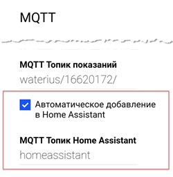
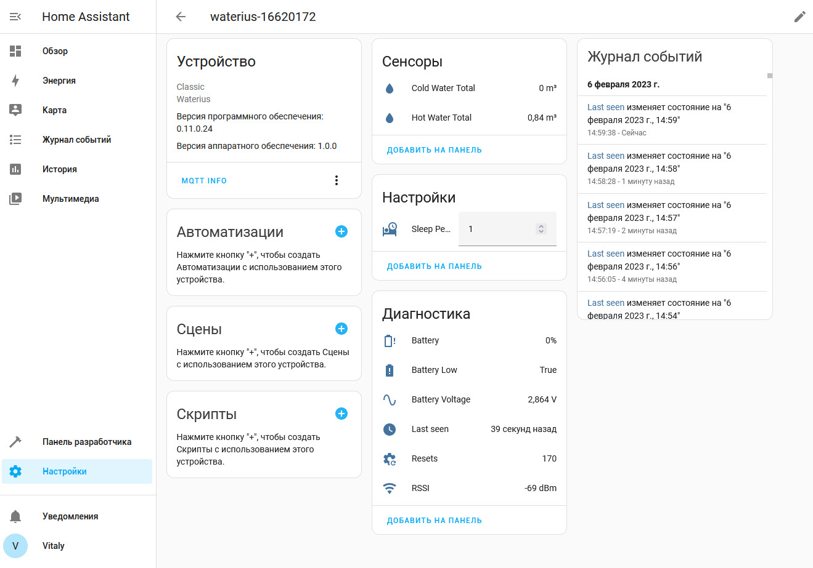
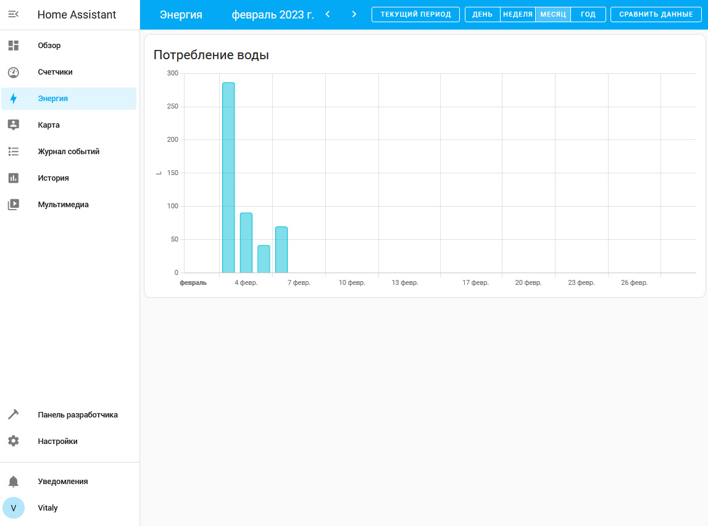
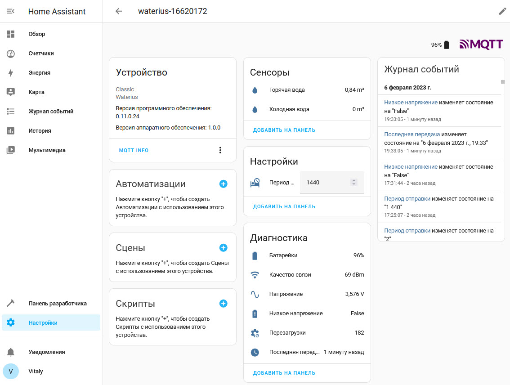

# Настройка интеграции c Home Assistant

Возможна настройка интеграции Ватериуса с Home Assistant в двух режимах:

- [автоматический](#автоматическая-настройка)
- [ручной](#ручная-настройка)

**Важно!** Для обеих режимов необходима настроенная интеграция Home Assistant c [брокером MQTT](https://www.home-assistant.io/integrations/mqtt/).

## Автоматическая настройка

Для включения автоматической настройки интеграции с Home Assistant при настройке ватериуса отметьте пункт "АВтоматическое добавление в Home Assistant"



После завершения настройки и отправки первых показаний в интерфейсе Home Assistant появится новое утсройство.



Для сенсоров показаний (холодная, горячая) и RSSI доступны дополнительные атрибуты, которые модно увидеть щелкнув на выбранный сенсор


После появления устройства и его показателей можно настроить панель "Энергия" для автомтатического посчета расходов.

Добавьте в свойствах панели "Энергия" показания расхода воды


После этого отчеты станут доступны в панели.



_Статистика может отражаться не сразу, а по прошествии некотрого времени._

### Перевод названий на русский

Для того чтобы автоматически добавить переводы ко всем показателям можно воспользоваться [настройкой](https://www.home-assistant.io/docs/configuration/customizing-devices/#customizing-entities). Для этого в конфигурационный файл `configuration.yaml` добавьте следующу секцию:

```yaml
homeassistant:
  customize_glob:
    "sensor.waterius_*_ch0":
      friendly_name: "Горячая вода"
    "sensor.waterius_*_ch1":
      friendly_name: "Холодная вода"
    "sensor.waterius_*_voltage_low":
      friendly_name: "Низкое напряжение"
    "sensor.waterius_*_battery":
      friendly_name: "Батарейки"
    "sensor.waterius_*_voltage":
      friendly_name: "Напряжение"
    "sensor.waterius_*_timestamp":
      friendly_name: Последняя передача
    "sensor.waterius_*_resets":
      friendly_name: "Перезагрузки"
    "sensor.waterius_*_rssi":
      friendly_name: "Качество связи"
    "number.waterius_*_period_min":
      friendly_name: "Период отправки"
```

После перезагрузки Home Assistant свойства устройства будут выглядеть следующим образом



## Ручная настройка

Предполагается, что у вас уже установлен MQTT брокер, а также соответствующая интеграция для Home Assistant.

[Видео инструкция](https://www.youtube.com/watch?v=50J8hMOy7Dc)

### Создание сенсоров

Со списком доступных параметров, а также их описанием можно ознакомиться по [ссылке](https://github.com/dontsovcmc/waterius/blob/master/Export.md)

Также параметры и их текущие значения можно посмотреть при помощи [MQTT Explorer](http://mqtt-explorer.com/)

Ознакомьтесь с примером файла конфигурации [configuration.yaml](homeassistant.configuration.yaml)

Обратите внимание, что название сенсора

```yaml
states.sensor.kholodnaia_voda.last_updated
```

у вас может отличаться, всё зависит от того как вы назвали сенсор слушающий топик расхода холодной воды *ch1*

## Создание автоматизаций

Приведённые ниже автоматизации отправляют уведомления в телеграмм о низком напряжении питания Ватериус, а также в случае если устройство не выходило на связь более 27 часов (100 000 сек)

#### Низкое напряжение на Ватериус

**NB:** Значение сенсора в entity_id может отличаться от указанного в примере, в случае если вы вносили изменения в название сенсоров.

```yaml
- alias: Ватериус низкое напряжение
  trigger:
  - platform: state
    entity_id: sensor.napriazhenie_pitaniia_vateriusa
    to: Низкое напряжение
  action:
  - service: notify.telega
    data:
      message: Внимание! На ватериус зафиксированно низкое напряжение
  mode: single
```

#### Ватериус не выходил на связь более 27 часов

**NB:** Значение сенсора в entity_id может отличаться от указанного в примере, в случае если вы вносили изменения в название сенсоров.

```yaml
- alias: Ватериус вне сети более 27 часов
  trigger:
  - platform: state
    entity_id: sensor.vaterius_last_seen
    to: '100000'
  action:
  - service: notify.telega
    data:
      message: Внимание! Ватериус вне сети более 27 часов.
  mode: single
```
